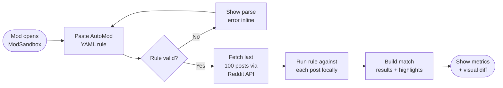
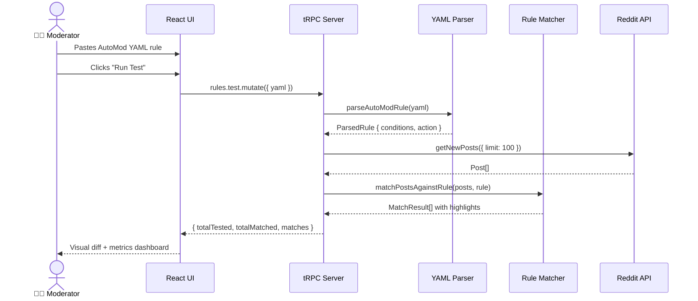
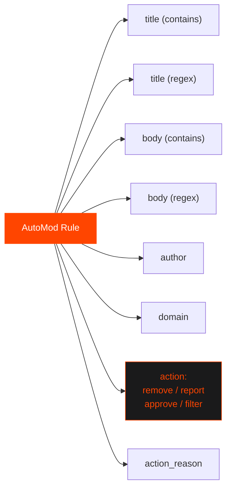
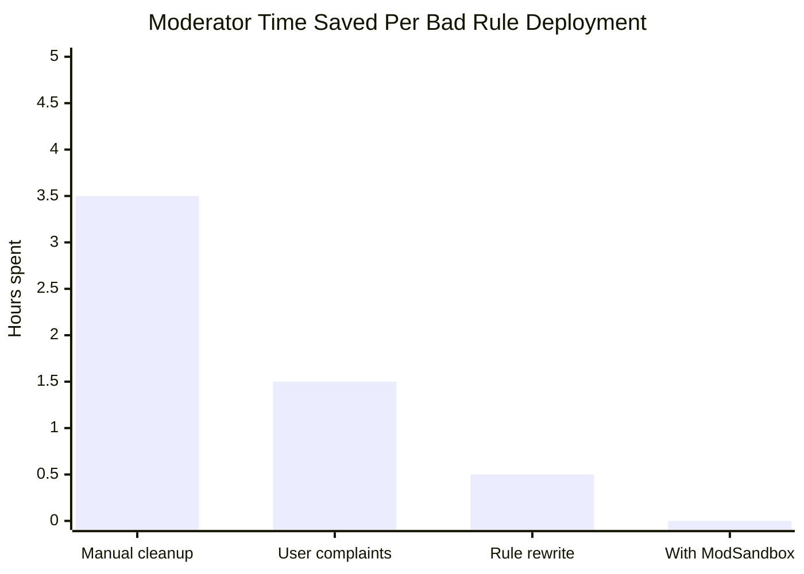
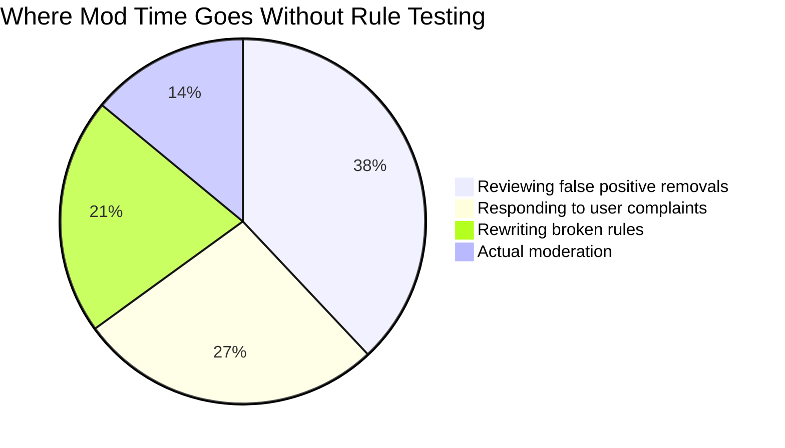
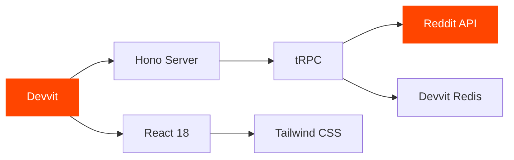

<div align="center">


# ModSandbox

### AutoMod Rule Tester for Reddit Moderators

**Test before you wreck. Deploy with confidence.**

[](https://developers.reddit.com)
[](https://www.typescriptlang.org)
[](https://react.dev)
[](https://trpc.io)
[](LICENSE)

---

*Built for the [Reddit Mod Tools & Migrated Apps Hackathon](https://devpost.com) · May 2026*

[**Install ModSandbox →**](https://developers.reddit.com/apps/modsandbox) · [Privacy Policy](https://itxashancode.github.io/modsandbox-legal/privacy) · [Terms of Use](https://itxashancode.github.io/modsandbox-legal/terms)

</div>

---

## The Problem

Every moderator knows this feeling: you write an AutoMod rule, paste it live, and then spend the next two hours manually restoring posts it incorrectly removed — or realising it missed every piece of spam it was supposed to catch.

**There has never been a safe way to test AutoMod rules before deploying them.**

Until now.

---

## The Solution

ModSandbox is a native Reddit app (built on Devvit) that lets moderators paste any AutoMod YAML rule and instantly test it against their subreddit's real recent posts — before a single live action is taken.

```
Paste rule → Run test → See highlights → Deploy with confidence
```

---

## How It Works



---

## Architecture

```mermaid
graph TB
    subgraph Client ["🖥️ Client — React + Tailwind (Browser iframe)"]
        S[splash.tsx\nLanding screen]
        G[game.tsx\nMain app UI]
        S -->|Tap to Start| G
    end

    subgraph Shared ["📦 Shared — TypeScript"]
        P[parser.ts\nYAML → Rule object]
        M[matcher.ts\nRule vs Posts engine]
        T[types.ts\nShared interfaces]
    end

    subgraph Server ["⚙️ Server — Hono + tRPC (Devvit runtime)"]
        TR[trpc.ts\nAPI router]
        RD[(Reddit API\ngetNewPosts)]
        RS[(Devvit Redis\nSaved rules)]
        TR --> RD
        TR --> RS
    end

    G -->|rules.test.mutate| TR
    TR -->|PostLike[]| M
    P --> M
    M -->|MatchResult[]| G
    T --> P
    T --> M
```

---

## Data Flow



---

## Features

| Feature | Description |
|---|---|
| 📝 **Rule Editor** | Paste any AutoMod YAML rule with real-time syntax feedback |
| 🔍 **Live Testing** | Tests against the last 100 real posts from your subreddit |
| 🟠 **Visual Diff** | Triggering text highlighted inline in every match card |
| 📊 **Match Metrics** | Posts tested · Total matches · Match rate — instantly |
| ⚠️ **False Positive Detection** | Spot overly aggressive rules before they go live |
| 💾 **Rule Saving** | Save draft rules to Devvit Redis, persisted between sessions |
| 🌙 **Dark Mode** | Fully supports Reddit's dark and light themes |
| 🔒 **Zero Data Collection** | No user data ever leaves Reddit's platform |

---

## Supported Rule Syntax



---

## Example Rule

```yaml
type: submission
title (contains): [free money, click here, limited offer, 100% guaranteed]
action: remove
action_reason: Possible spam — matched ModSandbox spam filter test
```

Paste this into ModSandbox → hit **Run Test** → see every post from your subreddit that would have been removed, with the matching phrase highlighted in orange.

---

## Impact





---

## Tech Stack



| Layer | Technology |
|---|---|
| Platform | [Devvit](https://developers.reddit.com) — Reddit's native app platform |
| UI | [React 18](https://react.dev) + [Tailwind CSS](https://tailwindcss.com) |
| API | [tRPC v11](https://trpc.io) — end-to-end typesafe |
| Server | [Hono](https://hono.dev) — lightweight edge-ready framework |
| Storage | Devvit Redis — scoped per-subreddit key-value store |
| Language | TypeScript 5 throughout (client + server + shared) |

---

## Project Structure

```
modsandbox/
├── src/
│   ├── client/
│   │   ├── splash.tsx        # Landing screen — greeting, tip, CTA
│   │   ├── game.tsx          # Main UI — editor, results, metrics
│   │   └── trpc.ts           # tRPC client config
│   ├── server/
│   │   ├── index.ts          # Hono server entry point
│   │   ├── trpc.ts           # API router — test, save, getSaved
│   │   └── routes/           # Menu items + install triggers
│   └── shared/
│       ├── types.ts          # ParsedRule, MatchResult, HighlightSegment
│       ├── parser.ts         # YAML → structured rule object
│       └── matcher.ts        # Rule engine + highlight range builder
├── public/                   # Static assets
├── devvit.json               # App config + permissions
├── vite.config.ts            # Build config
└── README.md
```

---

## Installation & Development

### Prerequisites

- Node.js 18+
- npm 8+
- A Reddit account that moderates at least one subreddit

### Setup

```bash
# 1. Install Devvit CLI
npm install -g devvit

# 2. Clone the repo
git clone https://github.com/itxashancode/modsandbox
cd modsandbox

# 3. Install dependencies
npm install

# 4. Log in with your Reddit account
devvit login

# 5. Upload app to Reddit's servers
devvit upload

# 6. Install to your test subreddit
devvit install r/YOURSUBREDDIT

# 7. Stream live logs while developing
devvit logs r/YOURSUBREDDIT
```

### Dev Loop

```bash
# Edit code → upload → refresh browser
devvit upload
```

> **Note:** There is no hot reload in Devvit. Every change requires `devvit upload` followed by a browser refresh (~15 seconds per cycle). Run `devvit logs r/YOURSUBREDDIT` in a separate terminal to stream console output.

---

## Using ModSandbox

1. Go to your subreddit
2. Open **Mod Tools** → click **"Create a new post"** (added by ModSandbox)
3. A ModSandbox post appears — tap **"Open Rule Tester"**
4. Paste your AutoMod YAML into the editor
5. Hit **Run Test**
6. Review the match cards — check highlights, look for false positives
7. Deploy the rule live with confidence

---

## Privacy & Security

- ModSandbox **does not collect, store, or share any personal data**
- Posts are read solely to test rules within the subreddit where the app is installed
- Rule drafts are stored in **Devvit Redis**, scoped exclusively to your subreddit
- **No data is transmitted** to any third-party service outside Reddit's platform
- The app runs entirely within Reddit's Devvit runtime — no external servers

[Privacy Policy](https://itxashancode.github.io/modsandbox-legal/privacy) · [Terms of Use](https://itxashancode.github.io/modsandbox-legal/terms)

---

## Roadmap

- [ ] Support for `author_flair` and `link_flair` conditions
- [ ] Comment testing (not just posts)
- [ ] Mod log comparison — match sandbox results against actual mod actions
- [ ] Rule history with version diffing
- [ ] Export matched posts as CSV for mod team review
- [ ] Scheduled background rule monitoring

---

## Contributing

PRs welcome. If you're a moderator and want a specific AutoMod rule type supported, open an issue with an example rule — include the YAML and describe what it should match.

---

## License

MIT © 2026 — Built with ❤️ for the Reddit mod community

---

<div align="center">
Built for the **Reddit Mod Tools & Migrated Apps Hackathon** · May 2026
*Helping moderators ship safer rules, one sandbox at a time.*
</div>